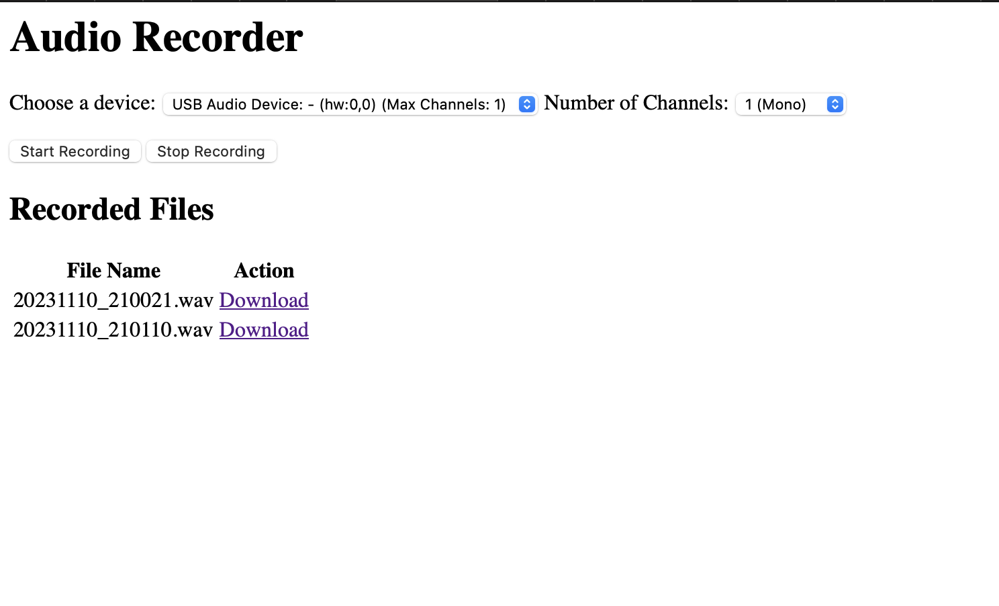

# remote_recorder

This is a python server that is running on a pi zero.

I used a USB sound card and got a TRS cable to plug into the output of my digital piano into the microphone port of the USB sound card. Then, plugged the sound card into the micro-USB port of the zero.

Setup cost:

- Pi-zero dev kit (include case and power bank): $35
- USB Sound card: $14 dollars
- USB Female to microUSB male: $5 dollars

Total setup cost: 55 + taxes

With this script I can start a recording and stop it manually and download the FLAC files to my computer. (Screenshot says WAV but I changed the script afterwards).

Enjoy!

Note: the script was 90% written by Chat-GPT with a few prompts for it to fix the script itself. Neat!

Copyright: Public domain.
